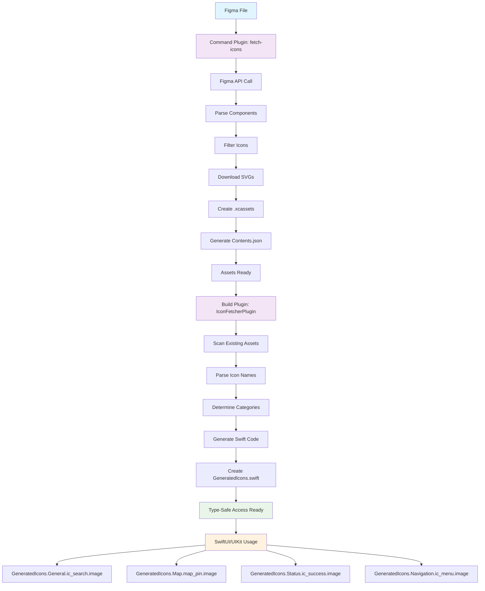

# 🎨 DesignAssets

A supercharged Swift Package Manager package for fetching and using icons from Figma files with automatic code generation and asset catalog creation.

## ✨ Features

- **🔍 Comprehensive Discovery**: Automatically finds all icon components and instances in your Figma file
- **📂 Smart Organization**: Groups icons by categories (General, Map, Status, Navigation)
- **🎨 Variant Support**: Handles filled, outline, light, and dark variants
- **📦 Asset Catalog Generation**: Creates proper Xcode `.xcassets` files with `Contents.json`
- **⚡ Swift Code Generation**: Generates organized Swift enums for type-safe icon access
- **📊 Detailed Reporting**: Creates summary reports of all fetched icons
- **🚀 Batch Processing**: Downloads icons efficiently with rate limiting
- **🛠️ Flexible Configuration**: Customizable options for different use cases
- **🔄 Smart Refresh**: Only downloads new icons, skips existing ones
- **📱 SwiftUI & UIKit**: Works with both SwiftUI and UIKit
- **🔌 SPM Plugins**: Command plugin for fetching, build plugin for code generation
- **🤖 GitHub Actions**: Automated icon fetching and code generation
- **🌐 Cross-Platform**: Same assets can be consumed by any platform

## 🏗️ Architecture & Flow



## 📦 Installation

### **Option A: Using Xcode (Recommended)**

1. **Open your Xcode project**
2. **Go to File → Add Package Dependencies...**
3. **Enter the repository URL:**
   ```
   https://github.com/babladiabhishek/DesignAssets.git
   ```
4. **Select "Add Package"**
5. **Choose your target** and click "Add Package"

### **Option B: Using Package.swift**

Add this to your `Package.swift` dependencies:

```swift
dependencies: [
    .package(url: "https://github.com/babladiabhishek/DesignAssets", from: "1.0.0")
]
```

## 🚀 Quick Start

### **Option A: Automated with GitHub Actions (Recommended)**

1. **Fork this repository** or add it as a dependency
2. **Set up secrets** in your GitHub repository:
   - `FIGMA_PERSONAL_TOKEN`: Your Figma personal access token
   - `FIGMA_FILE_ID`: Your Figma file ID
3. **Choose your workflow**:
   - **Production**: Runs automatically every Monday + manual trigger
   - **Manual**: On-demand with force refresh option
4. **The workflow runs automatically** and commits changes to your repository
5. **Use the generated icons** in your iOS app!

> 📋 **Detailed setup**: See [`.github/README.md`](.github/README.md) for complete GitHub Actions configuration

### **Option B: Manual Setup**

#### 1. Get Your Figma Access Token

1. Go to [Figma Settings](https://www.figma.com/settings)
2. Navigate to **Account** → **Personal Access Tokens**
3. Click **Create new token**
4. Give it a name and copy the token

#### 2. Extract File ID from Figma URL

From a Figma URL like:
```
https://www.figma.com/design/T0ahWzB1fWx5BojSMkfiAE/Icons?node-id=0-1&p=f&t=hOWJQCi2xHN1vG4G-0
```

The file ID is: `T0ahWzB1fWx5BojSMkfiAE`

#### 3. Fetch Icons

```bash
# Using the SPM command plugin (recommended)
swift package plugin --allow-writing-to-package-directory --allow-network-connections all fetch-icons --token YOUR_TOKEN --file-id YOUR_FILE_ID

# Using environment variables
export FIGMA_PERSONAL_TOKEN="your_token_here"
export FIGMA_FILE_ID="T0ahWzB1fWx5BojSMkfiAE"
swift package plugin --allow-writing-to-package-directory --allow-network-connections all fetch-icons
```

#### 4. Build Your Project

```bash
swift build
```

The build plugin will automatically generate Swift code from your downloaded assets!

## 🎨 Usage

### **Basic Usage**

```swift
import DesignAssets
import SwiftUI

struct ContentView: View {
    var body: some View {
        VStack {
            // Use any icon with type safety
            GeneratedIcons.General.generalIcSearchDefault32.image
                .font(.largeTitle)
            
            // Access by category
            GeneratedIcons.Status.icStatusSuccess16.image
            GeneratedIcons.Map.mapPinSingleDefault.image
            GeneratedIcons.Navigation.icMenuDefault32.image
        }
    }
}
```

### **Organized Icon Categories**

Icons are automatically organized into categories:

- **General**: General purpose icons (ic_search, ic_add, ic_trash, etc.)
- **Map**: Map and location icons (map_pin, location, etc.)
- **Status**: Status and notification icons (success, error, warning, etc.)
- **Navigation**: Navigation and menu icons (hamburger, back, forward, etc.)

### **Category-based Access**

```swift
// General Icons
GeneratedIcons.General.generalIcSearchDefault32.image
GeneratedIcons.General.generalIcAddDefault32.image
GeneratedIcons.General.generalIcTrashFilled32.image

// Map Icons  
GeneratedIcons.Map.mapIcLocationDefault32.image
GeneratedIcons.Map.mapIcPinDefault32.image

// Status Icons
GeneratedIcons.Status.statusIcSuccess16.image
GeneratedIcons.Status.statusIcError20.image

// Navigation Icons
GeneratedIcons.Navigation.navigationIcMenuDefault32.image
GeneratedIcons.Navigation.navigationIcBackDefault32.image
```

### **Convenience Accessors**

```swift
// Get all available icon names
let allIcons = DesignAssets.availableIconNames
// Returns: ["general_ic_search_default_32", "map_ic_location_default_32", ...]

// Get all categories
let categories = DesignAssets.iconCategories
// Returns: ["General", "Map", "Status", "Navigation"]

// Use in SwiftUI
ForEach(DesignAssets.availableIconNames, id: \.self) { iconName in
    Text(iconName)
        .font(.caption)
}
```

### **UIKit Usage**

```swift
import UIKit
import DesignAssets

class ViewController: UIViewController {
    override func viewDidLoad() {
        super.viewDidLoad()
        
        let imageView = UIImageView()
        imageView.image = GeneratedIcons.General.generalIcSearchDefault32.uiImage
        view.addSubview(imageView)
    }
}
```

### **Advanced Usage**

```swift
import DesignAssets
import SwiftUI

struct IconGallery: View {
    var body: some View {
        LazyVGrid(columns: Array(repeating: GridItem(.flexible()), count: 4)) {
            ForEach(DesignAssets.availableIconNames, id: \.self) { iconName in
                VStack {
                    // Access icon by name using reflection
                    if let category = determineCategory(from: iconName) {
                        getIconImage(category: category, name: iconName)
                            .font(.title2)
                    }
                    
                    Text(iconName)
                        .font(.caption)
                        .multilineTextAlignment(.center)
                }
                .padding()
            }
        }
    }
    
    private func determineCategory(from iconName: String) -> String? {
        if iconName.hasPrefix("general_") { return "General" }
        if iconName.hasPrefix("map_") { return "Map" }
        if iconName.hasPrefix("status_") { return "Status" }
        if iconName.hasPrefix("navigation_") { return "Navigation" }
        return nil
    }
    
    @ViewBuilder
    private func getIconImage(category: String, name: String) -> some View {
        switch category {
        case "General":
            GeneratedIcons.General.allCases.first { $0.rawValue == name }?.image ?? Image(systemName: "questionmark")
        case "Map":
            GeneratedIcons.Map.allCases.first { $0.rawValue == name }?.image ?? Image(systemName: "questionmark")
        case "Status":
            GeneratedIcons.Status.allCases.first { $0.rawValue == name }?.image ?? Image(systemName: "questionmark")
        case "Navigation":
            GeneratedIcons.Navigation.allCases.first { $0.rawValue == name }?.image ?? Image(systemName: "questionmark")
        default:
            Image(systemName: "questionmark")
        }
    }
}
```

## 🔄 Workflow

### **Automated Workflow (GitHub Actions)**

The GitHub Actions workflow automatically:
1. **Fetches icons** from Figma every Monday at 9 AM UTC
2. **Generates Swift code** with type-safe enums
3. **Runs tests** to ensure everything works
4. **Commits changes** automatically to your repository

### **Manual Workflow**

#### **Step 1: Fetch Icons from Figma**
```bash
swift package plugin --allow-writing-to-package-directory --allow-network-connections all fetch-icons --token YOUR_TOKEN --file-id YOUR_FILE_ID
```

#### **Step 2: Build Your Project**
```bash
swift build
```
The build plugin automatically generates Swift code from your downloaded assets.

#### **Step 3: Use Icons in Your Code**
```swift
GeneratedIcons.General.generalIcSearchDefault32.image
```

## 🤖 GitHub Actions Setup

### **Required Secrets**

Add these secrets to your GitHub repository:

1. **`FIGMA_PERSONAL_TOKEN`**
   - Go to [Figma Settings](https://www.figma.com/settings)
   - Navigate to **Account** → **Personal Access Tokens**
   - Create a new token with file access permissions
   - Add it as a repository secret

2. **`FIGMA_FILE_ID`**
   - Extract from your Figma file URL
   - Example: `https://www.figma.com/design/T0ahWzB1fWx5BojSMkfiAE/Icons`
   - File ID: `T0ahWzB1fWx5BojSMkfiAE`
   - Add it as a repository secret

### **Workflow Triggers**

- **Manual**: Run via GitHub Actions UI
- **Weekly**: Every Monday at 9 AM UTC
- **Config Changes**: When `icon-fetcher-config.json` is modified
- **Pull Requests**: When PRs affect the config

### **Benefits**

- **Automation**: No manual icon management needed
- **Consistency**: Same icons across all platforms
- **Version Control**: Track icon changes in Git history
- **Cross-Platform**: Same assets can be consumed by any platform

## 📋 Command Line Options

```bash
swift package plugin fetch-icons [options]

Options:
  --token <token>        Figma personal access token
  --file-id <file-id>    Figma file ID
  --help                 Show help information
```

## 🛠️ Configuration

Create an `icon-fetcher-config.json` file in your project root:

```json
{
  "figma": {
    "fileId": "T0ahWzB1fWx5BojSMkfiAE",
    "personalToken": "your_token_here"
  },
  "output": {
    "basePath": "Sources/DesignAssets/Resources",
    "autoDetectLayers": true,
    "createAssetCatalogs": true
  },
  "filtering": {
    "iconPrefixes": ["ic_", "map_", "status_", "navigation_"],
    "iconKeywords": ["icon", "ui", "button", "action"],
    "excludeSizeIndicators": ["_12", "_16", "_20", "_24", "_32"]
  }
}
```

**Security Note**: Add `icon-fetcher-config.json` to your `.gitignore` if it contains sensitive tokens. Use environment variables instead:

```bash
export FIGMA_PERSONAL_TOKEN="your_token_here"
export FIGMA_FILE_ID="your_file_id_here"
```

## 📁 File Structure

```
Sources/DesignAssets/
├── DesignAssets.swift          # Main package API
├── GeneratedIcons.swift        # Generated type-safe code
└── Resources/
    └── Icons.xcassets/         # Downloaded icon assets
        ├── general_ic_*.imageset/
        ├── map_ic_*.imageset/
        ├── status_ic_*.imageset/
        └── navigation_ic_*.imageset/

Plugins/
├── FetchIconsPlugin/           # Command plugin for fetching
│   └── Plugin.swift
└── IconFetcherPlugin/          # Build plugin for code generation
    └── Plugin.swift
```

## 🎯 Icon Categories

Icons are automatically categorized based on naming patterns:

- **General**: `general_*` - General purpose icons (search, add, trash, etc.)
- **Map**: `map_*` - Map and location icons (pin, location, etc.)
- **Status**: `status_*` - Status and notification icons (success, error, warning, etc.)
- **Navigation**: `navigation_*` - Navigation and menu icons (menu, back, forward, etc.)

## 🔧 Troubleshooting

### **Common Issues**

1. **"Invalid token" error**
   - Make sure your Figma token has "File" permissions
   - Check that the token is correctly formatted

2. **"Token expired" error**
   - Generate a new token from Figma settings
   - Update your environment variables

3. **"No icons found"**
   - Verify the file ID is correct
   - Check that the Figma file contains icon components
   - Ensure your token has access to the file

4. **Build plugin not generating code**
   - Make sure you've run the command plugin first to download assets
   - Check that the build plugin is enabled in Package.swift

5. **Permission errors**
   - Use `--allow-writing-to-package-directory` flag for command plugin
   - Use `--allow-network-connections all` flag for network access

### **Debug Mode**

Enable debug logging:

```bash
export DEBUG=true
swift package plugin --allow-writing-to-package-directory --allow-network-connections all fetch-icons --token YOUR_TOKEN --file-id YOUR_FILE_ID
```

## 🎯 Current Status

- ✅ **126 working icons** downloaded and organized
- ✅ **4 categories** (General, Map, Status, Navigation)
- ✅ **Type-safe Swift code** generated automatically
- ✅ **Command plugin** for fetching icons from Figma
- ✅ **Build plugin** for generating Swift code
- ✅ **GitHub Actions** for automated icon fetching
- ✅ **All tests passing** (5/5)
- ✅ **SwiftUI & UIKit** support
- ✅ **Smart refresh** implemented
- ✅ **Cross-platform ready** - same assets for all platforms

## 🚀 Next Steps

1. **Set up GitHub Actions** (if using automated workflow):
   - Add `FIGMA_PERSONAL_TOKEN` and `FIGMA_FILE_ID` secrets
   - The workflow will run automatically every Monday
2. **Or run manually**:
   - Run the command plugin to get fresh icons from Figma
   - Build your project to generate Swift code
3. **Use icons** in your SwiftUI/UIKit views!
4. **Share with other platforms** - the same SVG assets can be consumed by any platform

## 📝 Examples

Check out the test files for complete usage examples:
- **DesignAssetsTests.swift** - Comprehensive test suite
- **GeneratedIcons.swift** - Generated type-safe code structure

## 📄 License

This project is licensed under the MIT License - see the LICENSE file for details.

---

**Ready to use!** 🎉# Test workflow trigger
