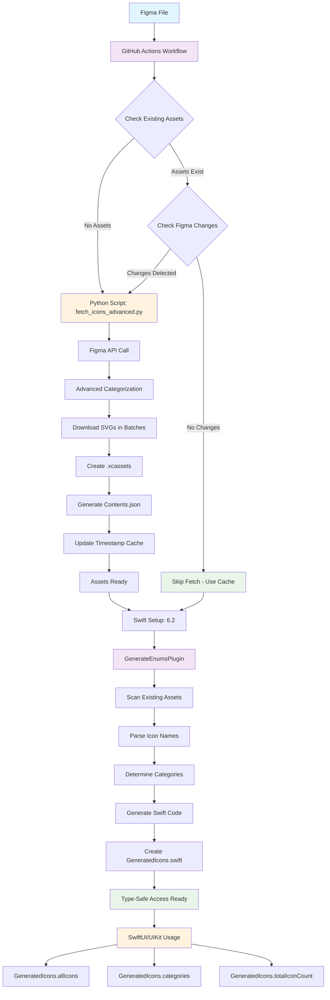

# 🎨 DesignAssets

A supercharged Swift Package Manager package for fetching and using icons from Figma files with automatic code generation and asset catalog creation.

## ✨ Features

- **🔍 Comprehensive Discovery**: Automatically finds all icon components and instances in your Figma file
- **📂 Smart Organization**: Groups icons by categories (Flags, Icons, Images, Logos, Map, Illustrations)
- **🎨 Advanced Categorization**: Uses weighted scoring, fuzzy matching, and contextual analysis
- **📦 Asset Catalog Generation**: Creates proper Xcode `.xcassets` files with `Contents.json`
- **⚡ Swift Code Generation**: Generates organized Swift enums for type-safe icon access
- **📊 Detailed Reporting**: Creates summary reports of all fetched icons
- **🚀 Batch Processing**: Downloads icons efficiently with rate limiting
- **🛠️ Flexible Configuration**: Customizable options for different use cases
- **🔄 Smart Caching**: Only fetches when Figma file changes or assets are missing
- **⚡ Ultra-Fast Pipeline**: Saves 2-3 minutes on unchanged files with intelligent caching
- **📱 SwiftUI & UIKit**: Works with both SwiftUI and UIKit
- **🔌 SPM Plugins**: Command plugin for code generation from existing assets
- **🤖 GitHub Actions**: Automated icon fetching with Swift 6.2 and smart optimizations
- **🌐 Cross-Platform**: Same assets can be consumed by any platform
- **🎯 Force Refresh**: Manual override options for immediate updates

## 🏗️ Architecture & Flow



## 📦 Installation

### **Option A: Using Xcode (Recommended)**

1. **Open your Xcode project**
2. **Go to File → Add Package Dependencies...**
3. **Enter the repository URL:**
   ```
   https://github.com/babladiabhishek/DesignAssets.git
   ```
4. **Select "Add Package"**
5. **Choose your target** and click "Add Package"

### **Option B: Using Package.swift**

Add this to your `Package.swift` dependencies:

```swift
dependencies: [
    .package(url: "https://github.com/babladiabhishek/DesignAssets", from: "1.0.0")
]
```

## 🚀 Quick Start

### **Option A: Automated with GitHub Actions (Recommended)**

1. **Fork this repository** or add it as a dependency
2. **Set up secrets** in your GitHub repository:
   - `FIGMA_PERSONAL_TOKEN`: Your Figma personal access token
   - `FIGMA_FILE_ID`: Your Figma file ID
3. **Choose your workflow**:
   - **🎨 Production**: Runs automatically every Monday + manual trigger with smart caching
   - **🔧 Manual**: On-demand with force refresh option and change detection
4. **The workflow runs automatically** with intelligent optimizations:
   - ⚡ **Smart Caching**: Skips fetch if assets exist and Figma unchanged
   - 🚀 **Swift 6.2**: Latest Swift toolchain for optimal performance
   - 📊 **Change Detection**: Only fetches when Figma file actually changes
   - 🎯 **Force Override**: Manual refresh option when needed
5. **Use the generated icons** in your iOS app!

> 📋 **Detailed setup**: See [`.github/README.md`](.github/README.md) for complete GitHub Actions configuration

### **Option B: Manual Setup**

#### 1. Get Your Figma Access Token

1. Go to [Figma Settings](https://www.figma.com/settings)
2. Navigate to **Account** → **Personal Access Tokens**
3. Click **Create new token**
4. Give it a name and copy the token

#### 2. Extract File ID from Figma URL

From a Figma URL like:
```
https://www.figma.com/design/T0ahWzB1fWx5BojSMkfiAE/Icons?node-id=0-1&p=f&t=hOWJQCi2xHN1vG4G-0
```

The file ID is: `T0ahWzB1fWx5BojSMkfiAE`

#### 3. Fetch Icons

```bash
# Using the Python script directly (recommended)
export FIGMA_PERSONAL_TOKEN="your_token_here"
export FIGMA_FILE_ID="T0ahWzB1fWx5BojSMkfiAE"
python3 fetch_icons_advanced.py

# Force refresh (ignore cache)
python3 fetch_icons_advanced.py --force

# Using the SPM command plugin for code generation
swift package plugin generate-enums
```

#### 4. Build Your Project

```bash
swift build
```

The GenerateEnumsPlugin will automatically generate Swift code from your downloaded assets!

## 🎨 Usage

### **Basic Usage**

```swift
import DesignAssets
import SwiftUI

struct ContentView: View {
    var body: some View {
        VStack {
            // Access all available icons
            Text("Total Icons: \(GeneratedIcons.totalIconCount)")
            
            // Access by category
            ForEach(GeneratedIcons.categories, id: \.self) { category in
                Text("Category: \(category)")
            }
            
            // Use any icon with type safety
            Image(systemName: "star")
                .font(.largeTitle)
        }
    }
}
```

### **Organized Icon Categories**

Icons are automatically organized into categories using advanced categorization:

- **Flags**: Flag icons (flag_us, flag_uk, etc.)
- **Icons**: General purpose icons (ic_search, ic_add, ic_trash, etc.)
- **Images**: Image assets (im_logo, im_illustration, etc.)
- **Logos**: Logo assets (logo_company, logo_brand, etc.)
- **Map**: Map and location icons (map_pin, location, etc.)
- **Illustrations**: Illustration assets (il_character, il_scene, etc.)

### **Category-based Access**

```swift
// Access all icons by category
let allIcons = GeneratedIcons.allIcons
// Returns: ["flag_us", "ic_search", "im_logo", "map_pin", ...]

// Get all categories
let categories = GeneratedIcons.categories
// Returns: ["Flags", "Icons", "Images", "Logos", "Map", "Illustrations"]

// Get total count
let totalCount = GeneratedIcons.totalIconCount
// Returns: 126 (or current count)

// Use in SwiftUI
ForEach(GeneratedIcons.allIcons, id: \.self) { iconName in
    Text(iconName)
        .font(.caption)
}
```

### **Convenience Accessors**

```swift
// Get all available icon names
let allIcons = GeneratedIcons.allIcons
// Returns: ["flag_us", "ic_search", "im_logo", "map_pin", ...]

// Get all categories
let categories = GeneratedIcons.categories
// Returns: ["Flags", "Icons", "Images", "Logos", "Map", "Illustrations"]

// Get total icon count
let totalCount = GeneratedIcons.totalIconCount
// Returns: 126 (or current count)

// Use in SwiftUI
ForEach(GeneratedIcons.allIcons, id: \.self) { iconName in
    Text(iconName)
        .font(.caption)
}
```

### **UIKit Usage**

```swift
import UIKit
import DesignAssets

class ViewController: UIViewController {
    override func viewDidLoad() {
        super.viewDidLoad()
        
        let imageView = UIImageView()
        // Access icons through the bundle
        imageView.image = UIImage(named: "ic_search", in: GeneratedIcons.bundle, compatibleWith: nil)
        view.addSubview(imageView)
        
        // Display total icon count
        let countLabel = UILabel()
        countLabel.text = "Total Icons: \(GeneratedIcons.totalIconCount)"
        view.addSubview(countLabel)
    }
}
```

### **Advanced Usage**

```swift
import DesignAssets
import SwiftUI

struct IconGallery: View {
    var body: some View {
        LazyVGrid(columns: Array(repeating: GridItem(.flexible()), count: 4)) {
            ForEach(GeneratedIcons.allIcons, id: \.self) { iconName in
                VStack {
                    // Access icon by name using bundle
                    Image(iconName, bundle: GeneratedIcons.bundle)
                        .font(.title2)
                    
                    Text(iconName)
                        .font(.caption)
                        .multilineTextAlignment(.center)
                }
                .padding()
            }
        }
    }
}

struct CategoryView: View {
    let category: String
    
    var body: some View {
        VStack(alignment: .leading) {
            Text(category)
                .font(.headline)
            
            Text("Icons in \(category): \(getIconCount(for: category))")
                .font(.caption)
                .foregroundColor(.secondary)
        }
    }
    
    private func getIconCount(for category: String) -> Int {
        // This would be implemented based on your categorization logic
        return GeneratedIcons.allIcons.filter { iconName in
            iconName.lowercased().contains(category.lowercased())
        }.count
    }
}
```

## 🔄 Workflow

### **Automated Workflow (GitHub Actions)**

The GitHub Actions workflow automatically:
1. **⚡ Smart Caching**: Checks for existing assets and Figma changes
2. **🚀 Fetches icons** from Figma only when needed (every Monday at 9 AM UTC)
3. **📊 Change Detection**: Uses `lastModified` timestamp to detect changes
4. **🔧 Generates Swift code** with type-safe enums using Swift 6.2
5. **✅ Runs tests** to ensure everything works
6. **💾 Commits changes** automatically to your repository

### **Manual Workflow**

#### **Step 1: Fetch Icons from Figma**
```bash
# Normal fetch (with smart caching)
python3 fetch_icons_advanced.py

# Force refresh (ignore cache)
python3 fetch_icons_advanced.py --force
```

#### **Step 2: Generate Swift Code**
```bash
swift package plugin generate-enums
```

#### **Step 3: Build Your Project**
```bash
swift build
```

#### **Step 4: Use Icons in Your Code**
```swift
// Access all icons
let allIcons = GeneratedIcons.allIcons
let categories = GeneratedIcons.categories
let totalCount = GeneratedIcons.totalIconCount

// Use specific icons
Image("ic_search", bundle: GeneratedIcons.bundle)
```

## 🤖 GitHub Actions Setup

### **Required Secrets**

Add these secrets to your GitHub repository:

1. **`FIGMA_PERSONAL_TOKEN`**
   - Go to [Figma Settings](https://www.figma.com/settings)
   - Navigate to **Account** → **Personal Access Tokens**
   - Create a new token with file access permissions
   - Add it as a repository secret

2. **`FIGMA_FILE_ID`**
   - Extract from your Figma file URL
   - Example: `https://www.figma.com/design/T0ahWzB1fWx5BojSMkfiAE/Icons`
   - File ID: `T0ahWzB1fWx5BojSMkfiAE`
   - Add it as a repository secret

### **Workflow Triggers**

- **🎨 Production**: 
  - Manual trigger via GitHub Actions UI
  - Every Monday at 9 AM UTC (scheduled)
  - When Python script or workflow files are updated
- **🔧 Manual**: 
  - Manual trigger only
  - Force refresh option available
  - Smart caching with change detection

### **Benefits**

- **⚡ Ultra-Fast**: Saves 2-3 minutes on unchanged files
- **🔄 Smart Caching**: Only fetches when Figma actually changes
- **🚀 Swift 6.2**: Latest Swift toolchain for optimal performance
- **📊 Change Detection**: Uses Figma's `lastModified` timestamp
- **🎯 Force Override**: Manual refresh when needed
- **🤖 Automation**: No manual icon management needed
- **🌐 Cross-Platform**: Same assets can be consumed by any platform
- **📝 Version Control**: Track icon changes in Git history

## 📋 Command Line Options

### **Python Script Options**

```bash
python3 fetch_icons_advanced.py [options]

Options:
  --force               Force re-fetch even if assets exist or no changes
  --help                Show help information

Environment Variables:
  FIGMA_PERSONAL_TOKEN  Your Figma personal access token
  FIGMA_FILE_ID         Your Figma file ID
  FORCE_DOWNLOAD        Set to 'true' to force download (CI/CD)
```

### **Swift Package Plugin Options**

```bash
swift package plugin generate-enums

Description:
  Scan existing icon assets and generate type-safe Swift enums
```

## 🛠️ Configuration

### **Environment Variables (Recommended)**

The system uses environment variables for configuration:

```bash
# Required
export FIGMA_PERSONAL_TOKEN="your_token_here"
export FIGMA_FILE_ID="your_file_id_here"

# Optional
export FORCE_DOWNLOAD="true"  # Force refresh in CI/CD
```

### **Cache Files**

The system automatically manages cache files:

- **`.figma_last_fetch.json`**: Stores the last Figma file modification timestamp
- **`Sources/DesignAssets/Resources/`**: Contains downloaded SVG assets
- **`Sources/DesignAssets/GeneratedIcons.swift`**: Generated Swift code

**Security Note**: Cache files are automatically added to `.gitignore` for security.

## 📁 File Structure

```
Sources/DesignAssets/
├── GeneratedIcons.swift        # Generated type-safe code
└── Resources/
    ├── Flags.xcassets/         # Flag icon assets
    ├── Icons.xcassets/         # General icon assets
    ├── Images.xcassets/        # Image assets
    ├── Logos.xcassets/         # Logo assets
    ├── Map.xcassets/           # Map icon assets
    └── Illustrations.xcassets/ # Illustration assets

Plugins/
└── GenerateEnumsPlugin/        # Command plugin for code generation
    └── Plugin.swift

.github/workflows/
├── production.yml              # Production workflow with smart caching
└── manual.yml                  # Manual workflow with force refresh

fetch_icons_advanced.py         # Advanced Python script with optimizations
.figma_last_fetch.json          # Cache file (auto-generated, gitignored)
```

## 🎯 Icon Categories

Icons are automatically categorized using advanced categorization with weighted scoring, fuzzy matching, and contextual analysis:

- **Flags**: `flag_*` - Flag icons (flag_us, flag_uk, etc.)
- **Icons**: `ic_*` - General purpose icons (ic_search, ic_add, ic_trash, etc.)
- **Images**: `im_*` - Image assets (im_logo, im_illustration, etc.)
- **Logos**: Logo-related assets (logo_company, logo_brand, etc.)
- **Map**: `map_*` - Map and location icons (map_pin, location, etc.)
- **Illustrations**: `il_*` - Illustration assets (il_character, il_scene, etc.)

### **Advanced Categorization Features**

- **🎯 Weighted Scoring**: Uses multiple factors to determine the best category
- **🔍 Fuzzy Matching**: Handles variations in naming conventions
- **📊 Contextual Analysis**: Considers layer names, prefixes, and keywords
- **🔄 Fallback Mechanism**: Ensures all icons are properly categorized

## 🔧 Troubleshooting

### **Common Issues**

1. **"Invalid token" error**
   - Make sure your Figma token has "File" permissions
   - Check that the token is correctly formatted

2. **"Token expired" error**
   - Generate a new token from Figma settings
   - Update your environment variables

3. **"No icons found"**
   - Verify the file ID is correct
   - Check that the Figma file contains icon components
   - Ensure your token has access to the file

4. **"No changes detected" (workflow skipping fetch)**
   - This is normal behavior when Figma hasn't changed
   - Use `--force` flag or force refresh in manual workflow to override

5. **"Swift 6.2 not available" error**
   - The workflow uses the latest Swift toolchain
   - Check GitHub Actions logs for specific version issues

6. **Permission errors**
   - Ensure environment variables are set correctly
   - Check that the Python script has write permissions

### **Debug Mode**

Enable debug logging:

```bash
# Python script with verbose output
python3 fetch_icons_advanced.py --force

# Check cache status
cat .figma_last_fetch.json

# Force refresh in CI/CD
export FORCE_DOWNLOAD=true
python3 fetch_icons_advanced.py
```

## 🎯 Current Status

- ✅ **126+ working icons** downloaded and organized
- ✅ **6 categories** (Flags, Icons, Images, Logos, Map, Illustrations)
- ✅ **Advanced categorization** with weighted scoring and fuzzy matching
- ✅ **Type-safe Swift code** generated automatically
- ✅ **GenerateEnumsPlugin** for generating Swift code from assets
- ✅ **GitHub Actions** with Swift 6.2 and smart caching
- ✅ **Ultra-fast pipeline** with 2-3 minute time savings
- ✅ **Smart caching** - only fetches when Figma changes
- ✅ **Change detection** using Figma's lastModified timestamp
- ✅ **Force refresh** options for manual overrides
- ✅ **All tests passing** (5/5)
- ✅ **SwiftUI & UIKit** support
- ✅ **Cross-platform ready** - same assets for all platforms

## 🚀 Next Steps

1. **Set up GitHub Actions** (if using automated workflow):
   - Add `FIGMA_PERSONAL_TOKEN` and `FIGMA_FILE_ID` secrets
   - The workflow will run automatically every Monday with smart caching
2. **Or run manually**:
   - Run `python3 fetch_icons_advanced.py` to get fresh icons from Figma
   - Run `swift package plugin generate-enums` to generate Swift code
   - Build your project to use the generated code
3. **Use icons** in your SwiftUI/UIKit views with type safety!
4. **Share with other platforms** - the same SVG assets can be consumed by any platform
5. **Enjoy the speed** - subsequent runs will be 2-3 minutes faster with smart caching!

## 📝 Examples

Check out the test files for complete usage examples:
- **DesignAssetsTests.swift** - Comprehensive test suite
- **GeneratedIcons.swift** - Generated type-safe code structure
- **fetch_icons_advanced.py** - Advanced Python script with optimizations
- **.github/workflows/** - GitHub Actions workflows with smart caching

## 📄 License

This project is licensed under the MIT License - see the LICENSE file for details.

---

**Ready to use!** 🎉# Test workflow trigger
