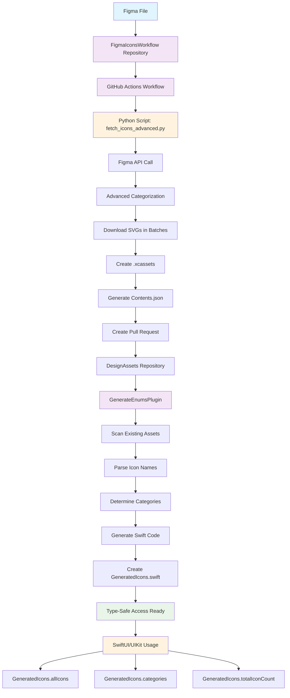

# 🎨 DesignAssets

A clean, lightweight Swift Package Manager package for consuming design assets from Figma with automatic code generation and type-safe access.

## ✨ Features

- **📦 Clean SPM Package**: Lightweight package focused on iOS asset consumption
- **🔌 GenerateEnumsPlugin**: Command plugin for generating Swift code from existing assets
- **📂 Smart Organization**: Groups icons by categories (Flags, Icons, Images, Logos, Map, Illustrations)
- **⚡ Swift Code Generation**: Generates organized Swift enums for type-safe icon access
- **📱 SwiftUI & UIKit**: Works with both SwiftUI and UIKit
- **🤖 Automated Workflow**: Icons are fetched and updated via external GitHub Actions workflow
- **🌐 Cross-Platform Ready**: Same assets can be consumed by any platform
- **🔄 Smart Caching**: Only updates when Figma file changes
- **⚡ Ultra-Fast**: Optimized for speed with intelligent caching

## 🏗️ Architecture & Flow



## 📦 Installation

### **Option A: Using Xcode (Recommended)**

1. **Open your Xcode project**
2. **Go to File → Add Package Dependencies...**
3. **Enter the repository URL:**
   ```
   https://github.com/babladiabhishek/DesignAssets.git
   ```
4. **Select "Add Package"**
5. **Choose your target** and click "Add Package"

### **Option B: Using Package.swift**

Add this to your `Package.swift` dependencies:

```swift
dependencies: [
    .package(url: "https://github.com/babladiabhishek/DesignAssets", from: "1.0.0")
]
```

## 🚀 Quick Start

### **Automated Workflow (Recommended)**

Icons are automatically fetched and updated via the [FigmaIconsWorkflow](https://github.com/babladiabhishek/FigmaIconsWorkflow) repository:

1. **Add this package** to your Xcode project or Package.swift
2. **Icons are automatically updated** via GitHub Actions workflow
3. **Pull requests are created** when new icons are available
4. **Merge the PR** to get the latest icons in your app
5. **Use the generated icons** with type-safe access!

### **Manual Code Generation**

If you have existing icon assets, you can generate Swift code manually:

```bash
# Generate Swift code from existing assets
swift package plugin generate-enums

# Build your project
swift build
```

The GenerateEnumsPlugin will scan your existing assets and generate type-safe Swift code!

## 🎨 Usage

### **Basic Usage**

```swift
import DesignAssets
import SwiftUI

struct ContentView: View {
    var body: some View {
        VStack {
            // Access all available icons
            Text("Total Icons: \(GeneratedIcons.totalIconCount)")
            
            // Access by category
            ForEach(GeneratedIcons.categories, id: \.self) { category in
                Text("Category: \(category)")
            }
            
            // Use any icon with type safety
            Image(systemName: "star")
                .font(.largeTitle)
        }
    }
}
```

### **Organized Icon Categories**

Icons are automatically organized into categories using advanced categorization:

- **Flags**: Flag icons (flag_us, flag_uk, etc.)
- **Icons**: General purpose icons (ic_search, ic_add, ic_trash, etc.)
- **Images**: Image assets (im_logo, im_illustration, etc.)
- **Logos**: Logo assets (logo_company, logo_brand, etc.)
- **Map**: Map and location icons (map_pin, location, etc.)
- **Illustrations**: Illustration assets (il_character, il_scene, etc.)

### **Category-based Access**

```swift
// Access all icons by category
let allIcons = GeneratedIcons.allIcons
// Returns: ["flag_us", "ic_search", "im_logo", "map_pin", ...]

// Get all categories
let categories = GeneratedIcons.categories
// Returns: ["Flags", "Icons", "Images", "Logos", "Map", "Illustrations"]

// Get total count
let totalCount = GeneratedIcons.totalIconCount
// Returns: 126 (or current count)

// Use in SwiftUI
ForEach(GeneratedIcons.allIcons, id: \.self) { iconName in
    Text(iconName)
        .font(.caption)
}
```

### **Convenience Accessors**

```swift
// Get all available icon names
let allIcons = GeneratedIcons.allIcons
// Returns: ["flag_us", "ic_search", "im_logo", "map_pin", ...]

// Get all categories
let categories = GeneratedIcons.categories
// Returns: ["Flags", "Icons", "Images", "Logos", "Map", "Illustrations"]

// Get total icon count
let totalCount = GeneratedIcons.totalIconCount
// Returns: 126 (or current count)

// Use in SwiftUI
ForEach(GeneratedIcons.allIcons, id: \.self) { iconName in
    Text(iconName)
        .font(.caption)
}
```

### **UIKit Usage**

```swift
import UIKit
import DesignAssets

class ViewController: UIViewController {
    override func viewDidLoad() {
        super.viewDidLoad()
        
        let imageView = UIImageView()
        // Access icons through the bundle
        imageView.image = UIImage(named: "ic_search", in: GeneratedIcons.bundle, compatibleWith: nil)
        view.addSubview(imageView)
        
        // Display total icon count
        let countLabel = UILabel()
        countLabel.text = "Total Icons: \(GeneratedIcons.totalIconCount)"
        view.addSubview(countLabel)
    }
}
```

### **Advanced Usage**

```swift
import DesignAssets
import SwiftUI

struct IconGallery: View {
    var body: some View {
        LazyVGrid(columns: Array(repeating: GridItem(.flexible()), count: 4)) {
            ForEach(GeneratedIcons.allIcons, id: \.self) { iconName in
                VStack {
                    // Access icon by name using bundle
                    Image(iconName, bundle: GeneratedIcons.bundle)
                        .font(.title2)
                    
                    Text(iconName)
                        .font(.caption)
                        .multilineTextAlignment(.center)
                }
                .padding()
            }
        }
    }
}

struct CategoryView: View {
    let category: String
    
    var body: some View {
        VStack(alignment: .leading) {
            Text(category)
                .font(.headline)
            
            Text("Icons in \(category): \(getIconCount(for: category))")
                .font(.caption)
                .foregroundColor(.secondary)
        }
    }
    
    private func getIconCount(for category: String) -> Int {
        // This would be implemented based on your categorization logic
        return GeneratedIcons.allIcons.filter { iconName in
            iconName.lowercased().contains(category.lowercased())
        }.count
    }
}
```

## 🔄 Workflow

### **Automated Workflow (External)**

Icons are managed by the [FigmaIconsWorkflow](https://github.com/babladiabhishek/FigmaIconsWorkflow) repository:

1. **🎨 FigmaIconsWorkflow** monitors your Figma file for changes
2. **⚡ Smart Caching** checks for existing assets and Figma changes
3. **🚀 Fetches icons** from Figma only when needed (every Monday at 9 AM UTC)
4. **📊 Change Detection** uses `lastModified` timestamp to detect changes
5. **🔧 Generates assets** with proper `.xcassets` structure
6. **📝 Creates Pull Request** to this DesignAssets repository
7. **✅ Merge PR** to get the latest icons in your app

### **Manual Code Generation**

If you have existing icon assets, generate Swift code:

```bash
# Generate Swift code from existing assets
swift package plugin generate-enums

# Build your project
swift build
```

### **Use Icons in Your Code**
```swift
// Access all icons
let allIcons = GeneratedIcons.allIcons
let categories = GeneratedIcons.categories
let totalCount = GeneratedIcons.totalIconCount

// Use specific icons
Image("ic_search", bundle: GeneratedIcons.bundle)
```

## 🤖 Workflow Setup

### **FigmaIconsWorkflow Repository**

The icon fetching and management is handled by a separate repository:

- **Repository**: [FigmaIconsWorkflow](https://github.com/babladiabhishek/FigmaIconsWorkflow)
- **Purpose**: Monitors Figma files and creates pull requests with updated icons
- **Benefits**: Keeps the SPM package lightweight and focused on consumption

### **Required Secrets (in FigmaIconsWorkflow)**

Add these secrets to the FigmaIconsWorkflow repository:

1. **`FIGMA_PERSONAL_TOKEN`**
   - Go to [Figma Settings](https://www.figma.com/settings)
   - Navigate to **Account** → **Personal Access Tokens**
   - Create a new token with file access permissions
   - Add it as a repository secret

2. **`FIGMA_FILE_ID`**
   - Extract from your Figma file URL
   - Example: `https://www.figma.com/design/T0ahWzB1fWx5BojSMkfiAE/Icons`
   - File ID: `T0ahWzB1fWx5BojSMkfiAE`
   - Add it as a repository secret

3. **`PAT_TOKEN`**
   - GitHub Personal Access Token with repository access
   - Used to create pull requests in this DesignAssets repository

### **Workflow Benefits**

- **⚡ Ultra-Fast**: Saves 2-3 minutes on unchanged files
- **🔄 Smart Caching**: Only fetches when Figma actually changes
- **🚀 Swift 5.8**: Compatible Swift toolchain for optimal performance
- **📊 Change Detection**: Uses Figma's `lastModified` timestamp
- **🎯 Force Override**: Manual refresh when needed
- **🤖 Automation**: No manual icon management needed
- **🌐 Cross-Platform**: Same assets can be consumed by any platform
- **📝 Version Control**: Track icon changes in Git history

## 📋 Command Line Options

### **Swift Package Plugin Options**

```bash
swift package plugin generate-enums

Description:
  Scan existing icon assets and generate type-safe Swift enums
```

### **External Workflow Options**

The FigmaIconsWorkflow repository handles all icon fetching:

```bash
# In FigmaIconsWorkflow repository
python3 scripts/fetch_icons_advanced.py [options]

Options:
  --force               Force re-fetch even if assets exist or no changes
  --help                Show help information

Environment Variables:
  FIGMA_PERSONAL_TOKEN  Your Figma personal access token
  FIGMA_FILE_ID         Your Figma file ID
  FORCE_DOWNLOAD        Set to 'true' to force download (CI/CD)
```

## 🛠️ Configuration

### **SPM Package Configuration**

This package is configured via `Package.swift`:

```swift
// swift-tools-version: 5.8
import PackageDescription

let package = Package(
    name: "DesignAssets",
    platforms: [.iOS(.v15), .macOS(.v12)],
    products: [
        .library(name: "DesignAssets", targets: ["DesignAssets"])
    ],
    targets: [
        .target(
            name: "DesignAssets",
            dependencies: [],
            resources: [.process("Resources")]
        ),
        .plugin(
            name: "GenerateEnumsPlugin",
            capability: .command(
                intent: .custom(
                    verb: "generate-enums",
                    description: "Scan existing icon assets and generate type-safe Swift enums"
                ),
                permissions: [
                    .writeToPackageDirectory(reason: "Generate Swift enums from existing icon assets")
                ]
            )
        )
    ]
)
```

### **External Workflow Configuration**

The FigmaIconsWorkflow repository handles all configuration:

- **Environment Variables**: Set in GitHub Actions secrets
- **Cache Files**: Managed automatically by the workflow
- **Asset Generation**: Creates proper `.xcassets` structure

## 📁 File Structure

```
Sources/DesignAssets/
├── GeneratedIcons.swift        # Generated type-safe code (auto-generated)
└── Resources/
    ├── Flags.xcassets/         # Flag icon assets (from workflow)
    ├── Icons.xcassets/         # General icon assets (from workflow)
    ├── Images.xcassets/        # Image assets (from workflow)
    ├── Logos.xcassets/         # Logo assets (from workflow)
    ├── Map.xcassets/           # Map icon assets (from workflow)
    └── Illustrations.xcassets/ # Illustration assets (from workflow)

Plugins/
└── GenerateEnumsPlugin/        # Command plugin for code generation
    └── Plugin.swift

Package.swift                   # SPM package configuration
README.md                       # This documentation
```

**Note**: Icon assets are automatically updated via pull requests from the [FigmaIconsWorkflow](https://github.com/babladiabhishek/FigmaIconsWorkflow) repository.

## 🎯 Icon Categories

Icons are automatically categorized using advanced categorization with weighted scoring, fuzzy matching, and contextual analysis:

- **Flags**: `flag_*` - Flag icons (flag_us, flag_uk, etc.)
- **Icons**: `ic_*` - General purpose icons (ic_search, ic_add, ic_trash, etc.)
- **Images**: `im_*` - Image assets (im_logo, im_illustration, etc.)
- **Logos**: Logo-related assets (logo_company, logo_brand, etc.)
- **Map**: `map_*` - Map and location icons (map_pin, location, etc.)
- **Illustrations**: `il_*` - Illustration assets (il_character, il_scene, etc.)

### **Advanced Categorization Features**

- **🎯 Weighted Scoring**: Uses multiple factors to determine the best category
- **🔍 Fuzzy Matching**: Handles variations in naming conventions
- **📊 Contextual Analysis**: Considers layer names, prefixes, and keywords
- **🔄 Fallback Mechanism**: Ensures all icons are properly categorized

## 🔧 Troubleshooting

### **Common Issues**

1. **"Invalid token" error**
   - Make sure your Figma token has "File" permissions
   - Check that the token is correctly formatted

2. **"Token expired" error**
   - Generate a new token from Figma settings
   - Update your environment variables

3. **"No icons found"**
   - Verify the file ID is correct
   - Check that the Figma file contains icon components
   - Ensure your token has access to the file

4. **"No changes detected" (workflow skipping fetch)**
   - This is normal behavior when Figma hasn't changed
   - Use `--force` flag or force refresh in manual workflow to override

5. **"Swift 6.2 not available" error**
   - The workflow uses the latest Swift toolchain
   - Check GitHub Actions logs for specific version issues

6. **Permission errors**
   - Ensure environment variables are set correctly
   - Check that the Python script has write permissions

### **Debug Mode**

Enable debug logging:

```bash
# Python script with verbose output
python3 fetch_icons_advanced.py --force

# Check cache status
cat .figma_last_fetch.json

# Force refresh in CI/CD
export FORCE_DOWNLOAD=true
python3 fetch_icons_advanced.py
```

## 🎯 Current Status

- ✅ **Clean SPM Package** - Lightweight and focused on consumption
- ✅ **GenerateEnumsPlugin** - Command plugin for generating Swift code from assets
- ✅ **Type-safe Swift code** - Generated automatically from existing assets
- ✅ **SwiftUI & UIKit** support - Works with both frameworks
- ✅ **Cross-platform ready** - Same assets for all platforms
- ✅ **External Workflow** - Icons managed by FigmaIconsWorkflow repository
- ✅ **Smart caching** - Only updates when Figma changes
- ✅ **Pull Request workflow** - Automated updates via PRs
- ✅ **Swift 5.8** - Compatible toolchain for optimal performance

## 🚀 Next Steps

1. **Add this package** to your Xcode project or Package.swift
2. **Set up FigmaIconsWorkflow** (if using automated workflow):
   - Add `FIGMA_PERSONAL_TOKEN`, `FIGMA_FILE_ID`, and `PAT_TOKEN` secrets
   - The workflow will run automatically every Monday with smart caching
3. **Merge pull requests** when new icons are available
4. **Generate Swift code** manually if needed:
   - Run `swift package plugin generate-enums` to generate Swift code
   - Build your project to use the generated code
5. **Use icons** in your SwiftUI/UIKit views with type safety!
6. **Share with other platforms** - the same SVG assets can be consumed by any platform

## 📝 Examples

Check out the test files for complete usage examples:
- **DesignAssetsTests.swift** - Comprehensive test suite
- **GeneratedIcons.swift** - Generated type-safe code structure
- **Plugins/GenerateEnumsPlugin/Plugin.swift** - Command plugin implementation

## 📄 License

This project is licensed under the MIT License - see the LICENSE file for details.

---

**Ready to use!** 🎉
